<p align="center">
  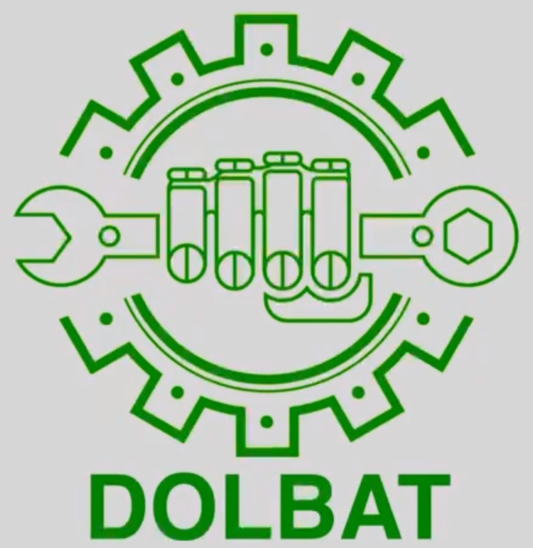
</p>

<h1 align="center">DolbotX</h1>

<p align="center">
  <strong>A versatile autonomous robot platform for complex perception and navigation challenges.</strong>
  <br>
  2nd Place Winner & Hanwha Aerospace Award Recipient at the 2025 Army Chief of Staff Cup.
</p>

<p align="center">
  <a href="#visualizations">Visualizations</a> •
  <a href="#core-features">Core Features</a> •
  <a href="#workspace-structure">Workspace Structure</a>•
  <a href="#getting-started">Getting Started</a> •
  <a href="#data-collection-workflow">Data Collection Workflow</a> •
  <a href="#usage">Usage</a>

</p>

## Introduction

The DolbotX repository was initially developed to tackle the five missions of The 2025 Army Chief of Staff Cup National Defense Robot Competition. The project documented here was instrumental in our team achieving **2nd Place in the National Defense Robot Division** and earning the **Hanwha National Defense Robot Award**, sponsored by Hanwha Aerospace.

## Overview

DolbotX is a versatile autonomous robot platform built on ROS2, engineered for complex perception and navigation challenges. The robot is designed to excel in a variety of simulated "seasonal" environments (Spring, Summer, Fall, Winter), a robot tracking mission, and a target-following mode for a Unitree Go2.

The system operates on a distributed computing architecture, typically split between a host laptop and an NVIDIA Jetson. It integrates multiple cameras, including an Intel RealSense depth camera, and interfaces with Arduino-based controllers for precise wheel motion and LED status indicators.

## Visualizations

<p align="center">
  <em><strong>Competition Run:</strong> End-to-end perception and planning from the <code>robot_vision/bezier_(season)_drive.py</code> pipeline.</em>
  <br>
  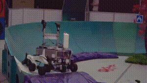
</p>

<p align="center">
  <em><strong>Single-Area Drive:</strong> A <code>robot_vision/(season)_drive.py</code> node navigating a smooth path through a single drivable region.</em>
  <br>
  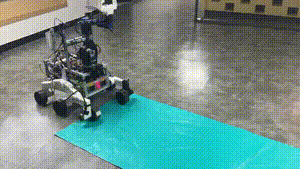
</p>

<p align="center">
  <em><strong>Multi-Area Drive:</strong> Watch the
  <code>robot_vision/(season)_drive.py</code> node's
 planning stack adapt across multiple drivable regions on YouTube Shorts.</em>
  <br>
  <a href="https://youtube.com/shorts/69BXtWKU-2o?si=P_e7tiKzJTd6eniV" target="_blank" rel="noopener">
    
  </a>
</p>

<p align="center">
  <em><strong>Vision Marker Following:</strong> Result of the <code>robot_vision/fall_vision.py</code> node, identifying and navigating towards a sequence of visual markers.</em>
  <br>
  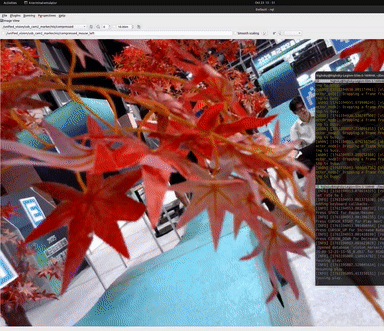
</p>

<p align="center">
  <em><strong>ROKA/Enemy Detection:</strong> Result of the <code>robot_vision/spring_vision.py</code> node, distinguishing between allied (ROKA) and enemy units.</em>
  <br>
  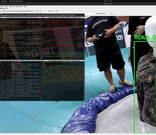
</p>

<p align="center">
  <em><strong>Supply Box Detection:</strong> Result of the <code>robot_vision/summer_vision.py</code> node. The algorithm identifies a supply box, measures the distance to it using the Intel RealSense camera, and sends the distance data via a ROS2 service.</em>
  <br>
  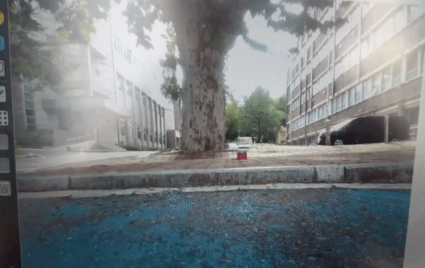
</p>

<p align="center">
  <em><strong>Unitree Go2 Tracking:</strong> The <code>robot_vision/unitree_tracker.py</code> node tracks the Unitree Go2 robot and visualizes the distance to its coordinate frame.</em>
  <br>
  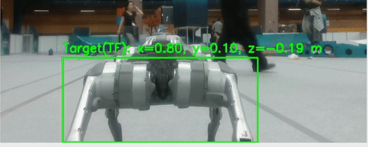
</p>

## Core Features

- **Seasonal Vision Algorithms:**
  - **Spring (Friend-or-Foe):** Identifies allied ("ROKA") vs. enemy units from military uniform data and controls an LED indicator accordingly.
  - **Summer (Multi-Task):** Concurrently recognizes traffic lights to issue 'stop'/'go' commands and detects supply boxes to trigger collection actions.
  - **Fall (Marker Following):** Detects and follows a sequence of visual markers (`A`, `E`, `Heart`, etc.).
  - **Winter (Snow Navigation):** Navigates snowy terrain by identifying a clear path from a fusion of standard track and snow segmentation.
- **Object Following:** Tracks and follows a Unitree Go2 robot using a model of its rear profile, maintaining a precise distance with depth data.
- **Drivable Area Segmentation:** Utilizes Bird's-Eye-View (BEV) and camera-space perception to identify and navigate drivable surfaces across various terrains (colored tracks, sand, gravel, snow). It generates and follows smooth paths, even with multiple drivable regions in the frame.
- **Multi-Camera Integration:** Fuses data from several USB cameras and an Intel RealSense depth camera for comprehensive environmental perception.
- **Hardware Integration:** Employs robust serial communication with Arduino controllers for low-level wheel and LED control.

## Workspace Structure

This ROS2 workspace is organized into the following key packages:

- `robot_vision/`: Contains all ROS2 nodes for computer vision, including seasonal missions, drivable area segmentation, and object tracking.
- `object_follower/`: Implements the robot-following logic, calculating wheel velocities based on the target's position.
- `steering_to_diff/`: A utility that converts high-level steering commands into differential drive velocities for the left and right wheels.
- `led_serial_bridge/`: A serial communication bridge to send status commands (`roka`, `enemy`, `none`) to the LED Arduino controller.
- `usb_cam/`: A flexible package for capturing and publishing images from V4L2-compatible USB webcams.
- `mtc_interfaces/`: Defines custom ROS2 messages and services for inter-package communication.
- `Arduino/`: Contains the Arduino sketches for all microcontroller-based components.

### In-Depth: `robot_vision` Package

The `robot_vision` package is the perception core of the robot, optimized for real-time performance in a distributed environment.

- **Architectural Highlights:**
  - **ONNX Model Inference:** Leverages the ONNX (Open Neural Network Exchange) format for high-speed, hardware-accelerated inference on the NVIDIA Jetson.
  - **Multithreaded Design:** ROS2 nodes use a multi-threaded architecture where the main thread handles message passing and worker threads perform intensive computations (e.g., inference, image processing). This ensures the ROS2 communication layer remains responsive.
- **Seasonal & Planning Nodes:**
  - **Vision Nodes:** `spring_vision.py`, `summer_vision.py`, `fall_vision.py`, and `unitree_tracker.py` handle mission-specific perception tasks.
  - **Path Planning Nodes:** `bezier_*_drive.py` nodes perform segmentation in BEV and generate smooth paths using Bézier curves, while `nobev_*_drive.py` nodes offer a simplified alternative operating directly in the camera's image space.

### In-Depth: `Arduino` Sketches

- `DolbotX_Wheel_Control/`: The primary sketch for the Arduino Mega. It receives target wheel velocities, uses two motor encoders and a PID loop for closed-loop speed control, and drives all six motors.
- `LED_Control/`: A simple sketch for an Arduino Uno/Nano that listens for serial commands ("roka", "enemy", "none") to control red and green status LEDs.
- `LEFT_MOTOR_FINAL/` & `RIGHT_MOTOR_FINAL/`: Development sketches for testing the motors on each side of the robot independently.

## Getting Started

### Prerequisites

**Hardware:**

- NVIDIA Jetson Orin Nano
- **Cameras:**
  - **Vision Cameras (`camera1`, `camera2`):** Abko APC 850 & Topsync TS-B7WQ3O, used for visual marker and uniform recognition.
  - **Driving Camera (`camera3`):** Logitech C922 Pro, dedicated to drivable area segmentation.
  - **Depth Camera:** Intel RealSense D435i, used to measure distances for Pick and Place tasks and for tracking the Unitree Go2 robot.
- Arduino Mega (Wheel Control) & Arduino Uno (LED Control)

**Software:**

- ROS2 Humble
- Python 3.10+
- `colcon` build tool
- **Required Ubuntu Packages:**
  ```bash
  sudo apt-get update
  sudo apt-get install ros-humble-realsense2-camera ros-humble-tf2-geometry-msgs python3-serial
  ```

### Dependencies

Install the required Python packages using the provided file:

```bash
pip install -r requirements.txt
```

This will install `ultralytics` along with specific versions of `numpy` and `pyrealsense2`.

### Installation

1. Clone this repository.
2. Source your ROS2 installation:
   ```bash
   source /opt/ros/humble/setup.bash
   ```
3. Build the workspace. Use `--symlink-install` for active Python development to avoid rebuilding after every change.
   ```bash
   # Standard build
   colcon build

   # Development build
   colcon build --symlink-install
   ```

## Data Collection Workflow

DolbotX can record synchronized RGB, depth, and pose streams. Use the following three-terminal routine to create a dataset for post-processing.

1. **Terminal 1 – Launch Recorder Node**

   ```bash
   ros2 run robot_vision unified_recorder.py
   ```

   *This captures metadata and timing signals to ensure all topics remain aligned.*
2. **Terminal 2 – Start ROS Bag Recording**

   ```bash
   ros2 bag record \
   /camera3/image_raw/compressed \
   /camera/color/camera_info \
   /camera/color/image_raw/compressed \
   /camera/aligned_depth_to_color/image_raw \
   /camera1/image_raw/compressed \
   /camera2/image_raw/compressed \
   /tf \
   /tf_static \
   -o my_robot_run_$(date +%Y-%m-%d-%H-%M-%S) \
   -s mcap \
   --compression-mode file \
   --compression-format zstd
   ```

   *MCAP with Zstd compression offers a good balance between file size and playback speed.*
3. **Terminal 3 – Run H.264 Converter**

   ```bash
   cd src/robot_vision/robot_vision/utils
   python h264_converter.py
   ```

   *This transcodes recorded image topics into an efficient H.264 format for labeling and analysis.*

## Usage

The robot's operation is modular. Run the following nodes in separate terminals.

### 1. Launch Cameras (on Jetson)

- **Trigger udev to recognize devices:**
  ```bash
  sudo udevadm trigger
  ```
- **Driving Camera (Logitech):**
  ```bash
  ros2 run usb_cam usb_cam_node_exe --ros-args --remap __ns:=/camera3 --params-file /home/nvidia/DolbotX/src/usb_cam/config/params_3.yaml
  ```
- **Left Camera (Abko):**
  ```bash
  ros2 run usb_cam usb_cam_node_exe --ros-args --remap __ns:=/camera1 --params-file /home/nvidia/DolbotX/src/usb_cam/config/params_1.yaml
  ```
- **Right Camera (Topsync):**
  ```bash
  ros2 run usb_cam usb_cam_node_exe --ros-args --remap __ns:=/camera2 --params-file /home/nvidia/DolbotX/src/usb_cam/config/params_2.yaml
  ```
- **RealSense Depth Camera:**
  ```bash
  ros2 launch realsense2_camera rs_launch.py
  ```

### 2. Launch Robot Base and Controllers

- **Steering to Differential Drive Converter:**
  ```bash
  ros2 launch steering_to_diff steering_to_diff.launch.py
  ```
- **Wheel Serial Bridge (Arduino Mega):**
  ```bash
  ros2 launch wheel_serial_bridge bridge.launch.py
  ```
- **LED Control Bridge (Arduino Uno):**
  ```bash
  ros2 run led_serial_bridge led_serial_bridge
  ```

### 3. Launch a Mission

Choose one of the following missions to run. Each mission requires launching nodes in separate terminals.

Before starting a seasonal mission, ensure the following core components are running:

- **Steering to Differential Drive Converter:**
  ```bash
  ros2 launch steering_to_diff steering_to_diff.launch.py
  ```
- **Wheel Serial Bridge (Arduino Mega):**
  ```bash
  ros2 launch wheel_serial_bridge bridge.launch.py
  ```

#### Spring Mission

<p align="center">
  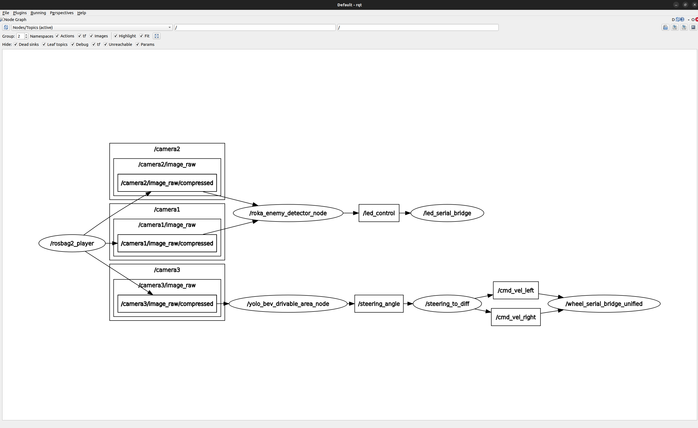
</p>

1. **Terminal 1: Launch Vision Node**

   ```bash
   ros2 run robot_vision spring_vision
   ```
2. **Terminal 2: Launch Drive Node**

   *Choose one depending on the terrain.*

   - For **flat ground**:
     ```bash
     ros2 run robot_vision springfall_drive
     ```
   - For **ramps/complex terrain**:
     ```bash
     ros2 run robot_vision bezier_springfall_drive
     ```

#### Summer Mission

<p align="center">
  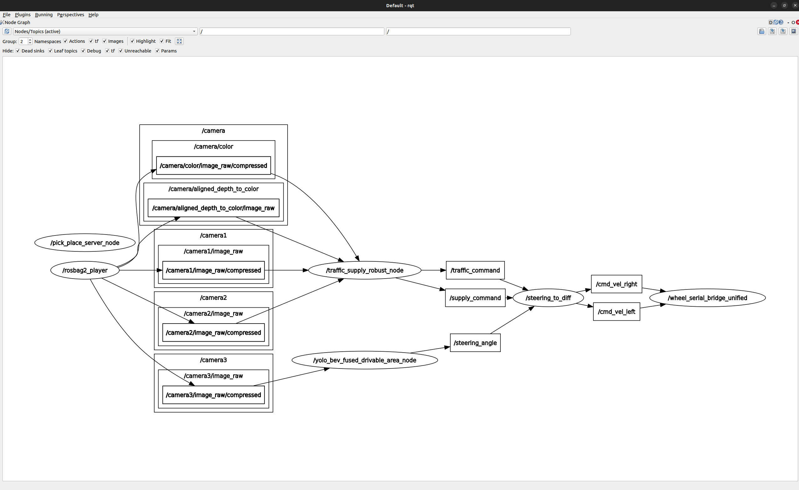
</p>

1. **Terminal 1: Launch Vision Node**

   ```bash
   ros2 run robot_vision summer_vision
   ```
2. **Terminal 2: Launch Drive Node**

   *Choose one depending on the terrain.*

   - For **flat ground**:
     ```bash
     ros2 run robot_vision summer_drive
     ```
   - For **ramps/complex terrain**:
     ```bash
     ros2 run robot_vision bezier_summer_drive
     ```

#### Fall Mission

<p align="center">
  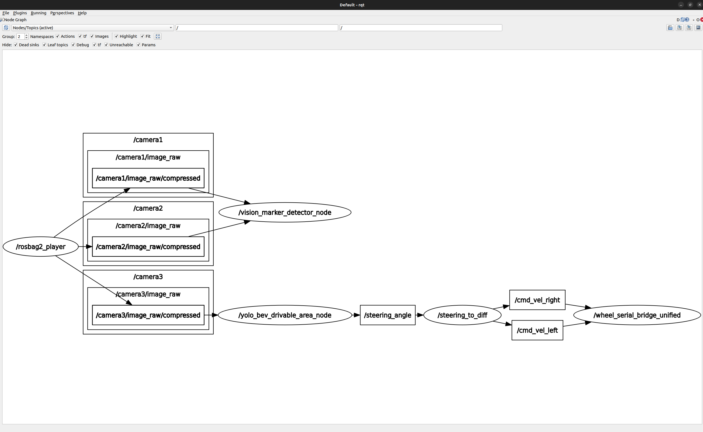
</p>

1. **Terminal 1: Launch Vision Node**

   ```bash
   ros2 run robot_vision fall_vision
   ```
2. **Terminal 2: Launch Drive Node**

   *Choose one depending on the terrain.*

   - For **flat ground**:
     ```bash
     ros2 run robot_vision springfall_drive
     ```
   - For **ramps/complex terrain**:
     ```bash
     ros2 run robot_vision bezier_springfall_drive
     ```

#### Winter Mission

<p align="center">
  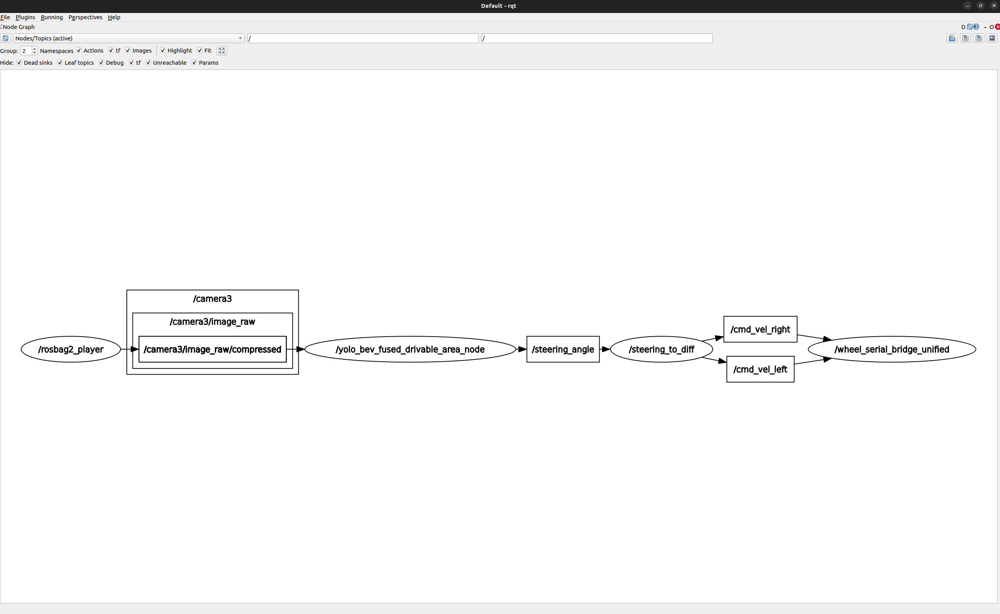
</p>

- **Launch Drive Node**

  *Choose one depending on the terrain.*

  - For **flat ground**:
    ```bash
    ros2 run robot_vision winter_drive
    ```
  - For **ramps/complex terrain**:
    ```bash
    ros2 run robot_vision bezier_winter_drive
    ```

#### Object Follower Mission

1. **Terminal 1: Launch Tracker Node**
   ```bash
   ros2 run robot_vision unitree_tracker
   ```
2. **Terminal 2: Launch Follower**
   ```bash
   ros2 launch object_follower object_follower.launch.py
   ```